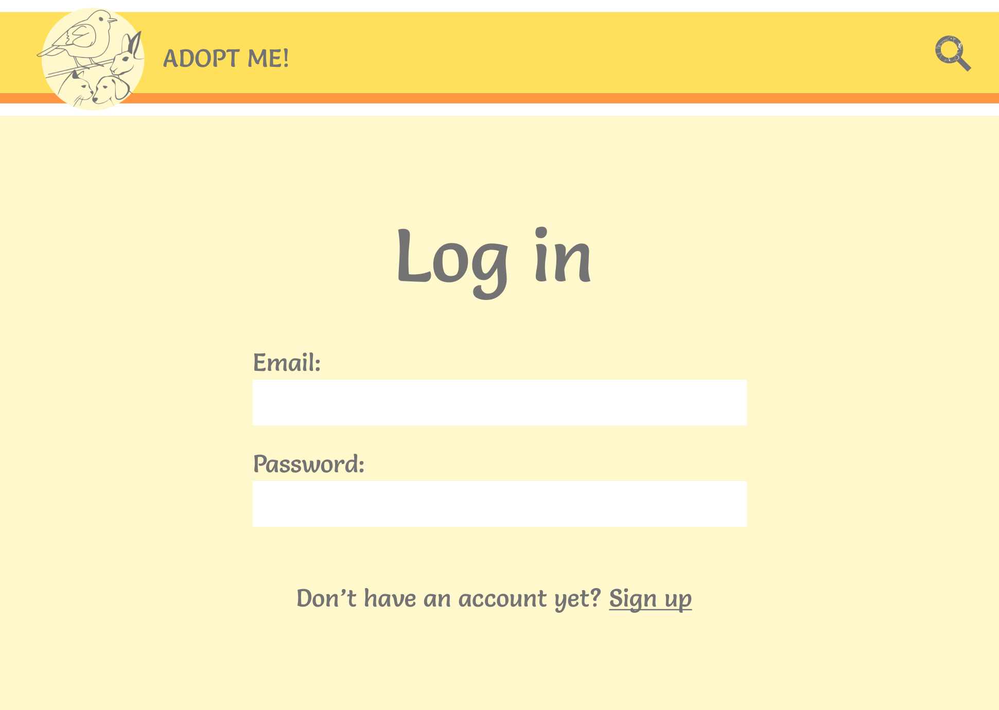
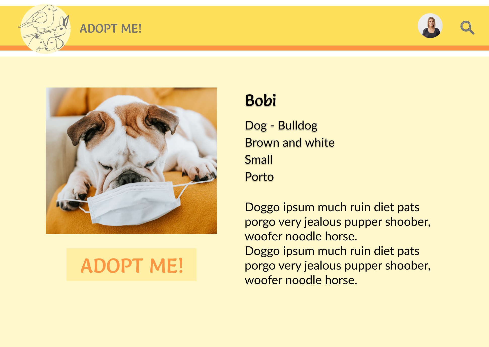

# ltw-project-g21

# Elements:
- [Bernardo Ferreira](https://github.com/BernardoFerreira00) (201806581)
- [Catarina Fernandes](https://github.com/catarina03) (201806610)
- [Jéssica Nascimento](https://github.com/jessymireie) (201806723)
- [João Vítor Fernandes](https://github.com/JViii) (201806724)

# Credentials (username/password (role))
- joao@gmail.com/joao123 
- bernardo@gmail.com/bernardo123 
- jessica@gmail.com/jessica123 
- catarina@gmail.com/catarina123 

# Libraries:
 - none

# Features:
 - Security
     - XSS: yes
     - CSRF: yes
     - SQL using prepare/execute: yes
     - Passwords: bcrypt
     - Data Validation: regex / php / html / javascript / ajax

 - Technologies
     - Separated logic/database/presentation: yes
     - Semantic HTML tags: yes
     - Responsive CSS: yes
     - Javascript: yes
     - Ajax: yes
     - REST API: no
 - Usability:
     - Error/success messages: yes
     - Forms don't lose data on error: no

# Mockups:

# Navigation

# Database

